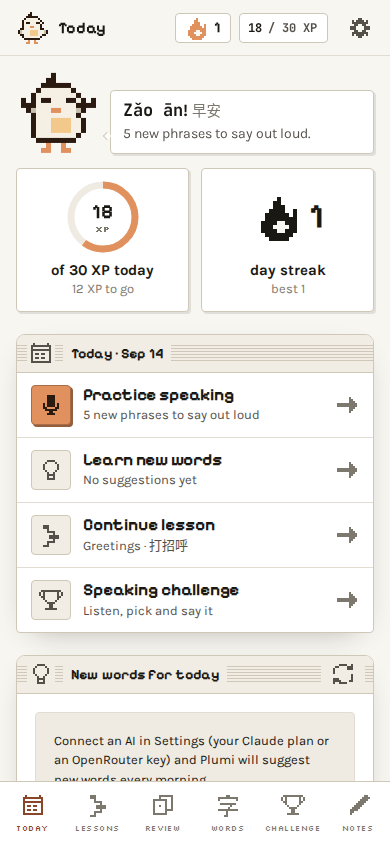
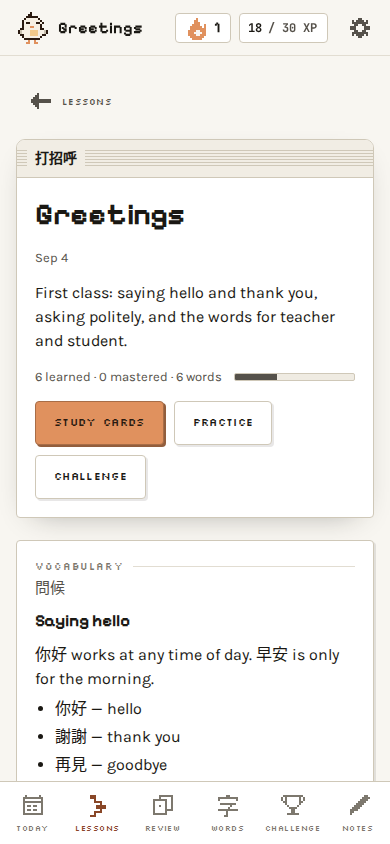
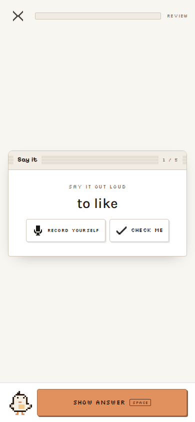
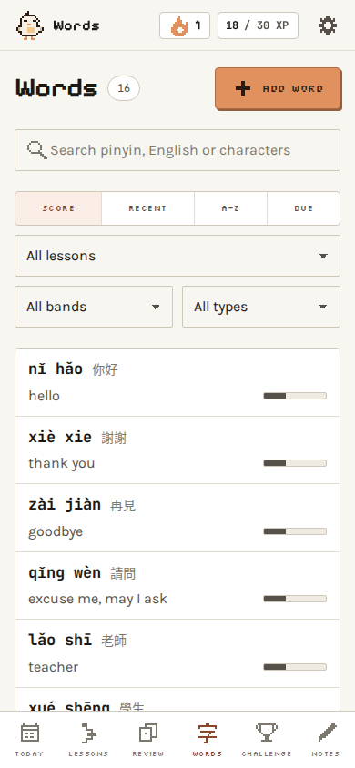

# PlumiMemoLang

Your own Traditional Chinese study desk, running on your computer. Paste the notes
from your class, a photo of the whiteboard or the pages of your textbook, and Plumi — a
small pixel bird — turns them into lessons and memo cards. Review them with spaced
repetition, practise saying them out loud, watch a memorization score grow for every
word, test yourself with Duolingo-style challenges, and get a few new words suggested
every morning.

Taiwan usage throughout: 繁體字, with 注音 or pinyin. It runs on macOS, Windows and Linux,
and your data never leaves your computer unless you ask an AI for a lesson.

<p align="center">
  
  
  
  
</p>

## What it does

| Screen | What you do there |
|---|---|
| **Today** | Streak, XP against a daily goal, what is due, today's suggested words, your lesson path. One tap into a session. |
| **Welcome** | The first time you open the app it asks what you want to be able to do (speak, understand, read or write characters), how you read Chinese, why you learn, and how much time you have. Every other screen follows those answers, and you can change them in Settings. |
| **Notes** | Paste raw notes or add photos of the whiteboard, or pick pages from one of your documents. The AI writes one or several lesson cards with their word lists; you review the draft, then import it. |
| **Lessons** | Your path, one node per class. Each lesson card has vocabulary, grammar points with examples, a dialogue, cultural tips. Study, practise, or challenge it. |
| **Review** | Spaced-repetition memo cards (SM-2 style). Card types follow your goals: "Say it" (read the meaning, say it aloud, record yourself and compare), listening and pinyin cards for speaking; character cards for reading and writing; and your own templates. |
| **Words** | Everything you have learned, searchable by 字, pinyin (tones optional), 注音 or meaning, with a 0–100 memorization score and a band: 生 new · 認 seen · 熟 familiar · 通 mastered. |
| **Challenge** | A mixed quiz built from your own words. For speaking: listen and pick the meaning, pick the pinyin, hear the tones, build the sentence from pinyin, and say it. For characters: pick the characters, fill the blank, build the sentence from characters. Plus an optional AI-written reading. |
| **Settings** | Your goals, 注音 or pinyin and how big characters are, the language Plumi explains things in, the AI (your own Claude plan, an OpenRouter key, and one order for every model), theme, voice, card templates, backup, and deleting your data. |

## Get started

### 1. Install Node.js

PlumiMemoLang needs [Node.js](https://nodejs.org) 22.12 or newer. The LTS installer from
nodejs.org is the easiest way on macOS and Windows. From a terminal instead:

| macOS | Windows | Linux |
|---|---|---|
| `brew install node` | `winget install OpenJS.NodeJS.LTS` | your package manager, or [nvm](https://github.com/nvm-sh/nvm) |

### 2. Get PlumiMemoLang

On GitHub, choose **Code → Download ZIP** and unzip it where you want to keep it, or clone it:

```bash
git clone https://github.com/THRAUR/PlumiMemoLang.git
```

### 3. Start it

- **macOS:** double-click `start-mac.command`. The first time, macOS may say it comes from an
  unidentified developer: right-click the file, choose **Open**, then **Open** again. If it
  does not open at all, run `chmod +x start-mac.command` once in Terminal, in that folder.
- **Windows:** double-click `start-windows.cmd`. If SmartScreen appears, choose
  **More info → Run anyway**.
- **Linux, or any terminal:** `npm install`, then `npm run launch`. (`npm start` does the
  same without opening the browser; the app is at http://127.0.0.1:3080.)

The first start installs the app's one dependency; after that it starts in a second and
opens in your browser. Keep the window open while you study, and close it to stop the app.

### 4. Connect an AI

Open **Settings → AI** and connect at least one:

- **Your Claude plan.** If [Claude Code](https://claude.com/claude-code) is installed and
  logged in on this computer, switch on Claude Sonnet. Its calls are included in your
  Claude subscription.
- **An OpenRouter key.** Create one at [openrouter.ai/keys](https://openrouter.ai/keys) and
  paste it. You pay per call, usually a fraction of a cent.

With both, your plan answers first and OpenRouter steps in when it cannot.

### Optional extras

| For | macOS | Windows | Linux |
|---|---|---|---|
| Lessons from PDFs (poppler) | `brew install poppler` | `scoop install poppler` or `choco install poppler` | `sudo apt install poppler-utils` |
| Word and PowerPoint files (LibreOffice) | `brew install --cask libreoffice` | `winget install TheDocumentFoundation.LibreOffice` | `sudo apt install libreoffice` |
| Your Claude plan (Claude Code) | `curl -fsSL https://claude.ai/install.sh \| bash` | PowerShell: `irm https://claude.ai/install.ps1 \| iex` | `curl -fsSL https://claude.ai/install.sh \| bash` |

After installing Claude Code, run `claude` once and log in. Restart PlumiMemoLang after
installing any of these; it finds them by itself, and Settings and the Notes screen say
what your computer can do.

### On your phone

The app has no login, so keep it on `127.0.0.1` and let [Tailscale](https://tailscale.com)
put HTTPS in front of it for your own devices:

```bash
tailscale serve --bg --https=8449 http://127.0.0.1:3080
```

Open `https://<this-computer>.<your-tailnet>.ts.net:8449` on the phone and add it to the
home screen. Setting `MEMOLANG_HOST=0.0.0.0` also works, but only on a network you trust
completely: anyone who can reach the port can read your notes and use your AI.

### Keep it running

On a computer that stays on, `ecosystem.config.cjs` runs it under
[pm2](https://pm2.keymetrics.io) and brings it back after a reboot. Start it from a plain
login shell; the file explains why.

```bash
pm2 start ecosystem.config.cjs && pm2 save
pm2 restart plumimemolang      # after changing anything in server/
```

### Configuration

Copy `.env.example` to `.env`. Every value is optional.

| Variable | Default | Meaning |
|---|---|---|
| `OPENROUTER_API_KEY` | — | Your key. The one saved in Settings wins over this. |
| `MEMOLANG_PORT` | `3080` | Port to listen on (`PORT` is honoured as a fallback). |
| `MEMOLANG_HOST` | `127.0.0.1` | Interface to bind. The generic `HOST` variable is ignored on purpose. |
| `MEMOLANG_DATA_DIR` | `./data` | Where your data lives. Back up this folder, or use Settings → Data. |
| `MEMOLANG_CLAUDE_BIN` | found by itself | The `claude` command, if it is not in `~/.local/bin`, `~/.claude/local` or on `PATH`. |
| `MEMOLANG_POPPLER_PATH` | found by itself | The folder that holds `pdftoppm`, if poppler is installed somewhere unusual. |
| `MEMOLANG_SOFFICE` | found by itself | LibreOffice's `soffice` program, if it is not on `PATH` or in the usual place. |

## Learning to speak first

If you tell the welcome questions you want to speak and understand, the app treats
pinyin (or 注音) and your own language as the main text and keeps characters small, as a
reference for the original meaning. Cards and challenges switch to sound: say it out
loud, record yourself and play it back next to the voice, hear the tones, build
sentences from pinyin. Lesson dialogues have a practice mode where Plumi plays one
line, you say the next, and you can take a role. Recording needs the page to be
served over HTTPS (tailscale serve does that) or opened on the computer itself. Where the
browser offers speech recognition, a "Check me" button tells you what it heard.

## Documents: lessons from the pages you covered

Upload a PDF, such as the scan of your textbook, once. Say whether to keep it in your
library or use it once. Then type the pages your class covered, like `9-11, 25`, using
the numbers printed in the book: set once which PDF page shows printed page 1, and
the thumbnails confirm you picked the right pages. Choose one lesson, one per page
range, or let Plumi decide, add instructions if you want ("skip the exercises"), and
the AI reads the page images and writes the lessons. Pages that already became
lessons are marked, so after the next class you only pick the new ones.

- Up to 20 pages per run and 500 MB per file.
- Word and PowerPoint files are converted to PDF when LibreOffice is installed; a LibreOffice
  without Writer converts presentations only. The upload card says what your computer supports.
- Documents are not in the backup file (a scanned book is too big): keep the PDFs.

## How the AI is used (and paid for)

Plumi writes everything for you — meanings, translations, lessons, explanations, answers —
in the language you pick under **Settings → Explain things in**, even when your class notes
are in English.

Models are tried in the order Settings shows: when one fails, Plumi moves down to the next,
so a lesson still gets written when a model is down or rate-limited. Reorder them and test
each one in Settings. The list lives in `server/ai/models.js`.

### Your own Claude plan

If Claude Code is installed and logged in on the computer the app runs on, Settings → AI
shows your plan (Pro, Max…) and lets you switch on Claude Sonnet, Opus or Haiku. Their calls
go through Claude Code, so they are included in your subscription and cost no OpenRouter
credits. They do count toward your plan's usage limits, the same ones your own Claude chats
and Claude Code use; Settings shows how much of the 5-hour window is used.

- Sonnet is the fit for this app. Opus is the most careful and uses your limits fastest;
  Haiku is the fastest.
- Plumi runs Claude Code as a plain model: no tools, plugins or MCP servers, no saved
  sessions, and low effort, so a short class note becomes a lesson in about a minute.

### OpenRouter

Plumi ships with a short list of OpenRouter models, chosen for Traditional characters,
Taiwan vocabulary and 注音 at a low price:

| Order | Model | Why it sits there |
|---|---|---|
| 1 | Gemini 3.5 Flash Lite | The newest of the four and the safest for Traditional characters, Taiwan vocabulary and 注音. Reads photos. |
| 2 | Gemini 3.1 Flash Lite | One generation older, same strengths. Reads photos. |
| 3 | DeepSeek V4 Flash 0423 | Strong Chinese and the cheapest, but text only, so photo notes skip it. |
| 4 | Gemini 2.5 Flash Lite | The oldest and weakest, but reads photos: the last resort that works for everything. |

To use another model, add it to `server/ai/models.js` (and, if your key has a guardrail
allow-list on openrouter.ai, to that list too).

### What each call does

| Task | What it does |
|---|---|
| Notes → lesson | Reads your raw notes (text and photos) or document pages, writes the lesson card and the word list with 注音, pinyin, meanings and examples. What it writes is what you will learn. |
| Daily new words | Picks a few useful words you do not know yet, close to what you are studying. |
| Reading challenge | Writes a short passage at your level from your own words, with questions. |
| Complete a word | Fills in missing readings and examples for one word. |
| Explain / ask | Answers a quick question about a word. |

Each call is logged with its token counts and cost (OpenRouter reports the price);
Settings shows today's and this month's spend against a budget you set. A call your
Claude plan answered is logged as included: it costs nothing here, and Settings shows what
it would have cost at API prices. Prompts are kept compact: the model only ever sees the
characters you already know, never your whole dictionary.

## Your data

- Everything is plain JSON in the `data` folder next to the app: back that folder up and you
  have backed up everything. Settings → Data downloads a backup and restores one.
- Your OpenRouter key stays on your computer. It is never sent to the browser, and backups
  leave it out.
- Your notes, photos and document pages leave your computer only when you ask for a lesson,
  and only to the AI you connected.
- **Settings → Delete data** lists what the app holds: lessons, words, class notes,
  documents, XP and streak, word suggestions, the AI usage log, your goals, your personal
  info, your settings and the OpenRouter key. Each has its own Delete, and each confirmation
  says what goes and what stays. "Delete everything" asks you to type DELETE, then takes the
  data folder back to a fresh install. Nothing deleted can be brought back, so every
  confirmation offers the backup first. Your Claude login is never touched.

## The memorization score

Each word carries a spaced-repetition state: an ease factor, an interval, a due
date. The score you see (0–100) combines how likely you still remember the word
today (it decays past the due date), how far apart your reviews have become
(stability), and your recent accuracy on it. Bands: 生 0–24, 認 25–49, 熟 50–74,
通 75–100.

## Where things live

```
server/       Express app, JSON store, scheduler (srs.js), AI tasks and providers, routes
shared/       pinyin ↔ 注音 utilities and learner goals, used by both server and browser
public/       the app — no build step; plume.css holds the design tokens
docs/         ARCHITECTURE.md, the contract every module follows; screenshots
test/         node:test suites
scripts/      seed data, screenshot tools
data/         your words, lessons, notes, progress (created on first start, never in git)
```

The look is **Plume**, the design system shared by the Plumi family: paper-white
early-Macintosh canvas, one terracotta accent, pixel display type, hard-offset
shadows that press down, and Plumi the bird.

## Develop

```bash
npm test                      # unit and route tests (node:test), also run on macOS, Windows and Linux in CI
npm run smoke                 # starts the real server on a spare port and checks it serves the app
npm run smoke -- --launcher   # the same through this system's double-click launcher, as CI does first
npm run dev                   # restarts on server changes
node scripts/seed.mjs http://127.0.0.1:3080   # fills a running server with sample words and lessons
scripts/qa.sh 3098 /tmp/qa    # Linux or macOS: seeded server + screenshots of every screen
```

Use a throwaway data folder while developing (`MEMOLANG_DATA_DIR=/tmp/plumi npm start`), and
read `docs/ARCHITECTURE.md` and `CLAUDE.md` before changing things.

## Credits

- Fonts: [Pixelify Sans](https://github.com/eifetx/Pixelify-Sans),
  [Silkscreen](https://github.com/googlefonts/silkscreen),
  [Karla](https://github.com/googlefonts/karla) and
  [JetBrains Mono](https://github.com/JetBrains/JetBrainsMono), all under the SIL Open Font
  License (texts in `public/fonts/licenses/`).
- Built with [Express](https://expressjs.com). PDFs are read with
  [poppler](https://poppler.freedesktop.org) and office files converted with
  [LibreOffice](https://www.libreoffice.org), when you have them installed.

## Licence

MIT — see [LICENSE](LICENSE).
